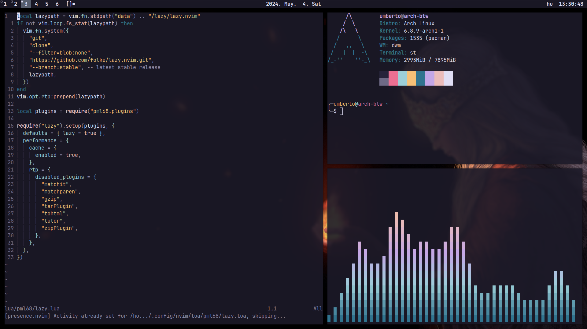

# suckless-setup

My personal suckless setup.

- Palenight color scheme and JetBrainsMono Nerd Font by default (colors from [Palenight VSCode Extension](https://github.com/whizkydee/vscode-palenight-theme/))
- Custom keybindings:
    - Alt+Shift+D: Opens Discord
    - Alt+Shift+F: Opens Firefox
    - PrtScr: Opens Flameshot

## Installation
Install necessary packages (Arch Linux specific, other distros will differ)
```sh
sudo pacman -S picom feh flameshot ttf-jetbrains-mono-nerd
```

Clone the repo
```sh
git clone https://github.com/pml68/suckless-setup
cd suckless-setup/
```

Replace config files
```sh
sudo mv picom.conf /etc/xdg/picom.conf

# optional
mv neofetch/config.conf ~/.config/neofetch/config.conf
```

Build and install each program manually or with the included script
```sh
./install.sh
```

Set the background
```sh
feh --bg-fill wallpaper.jpg
```

Update your .xinitrc file
```sh
# ...
~/.fehbg &
picom &
flameshot &
slstatus &
exec dwm
```

# Screenshot:


